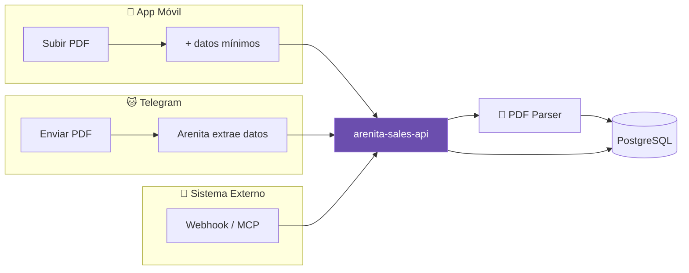
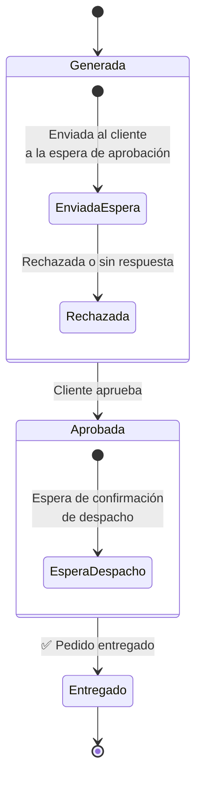
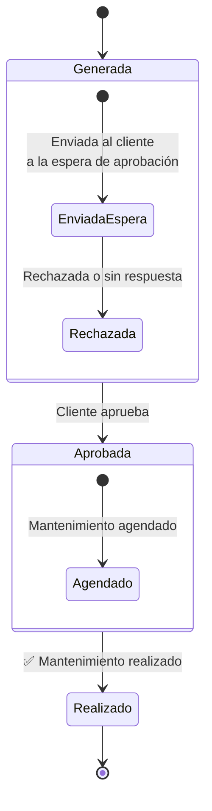

# 🐱 Arenita Sales API

Backend del sistema de gestión de proformas y ventas para equipos comerciales. Multi-empresa, con integración por API, webhooks y MCP.

## Stack
- **Kotlin** + **Spring Boot 3**
- **PostgreSQL** (H2 para dev)
- **Apache PDFBox** para parsing de PDFs
- **Spring Security** + JWT
- **OpenAPI/Swagger**

## Quick Start

```bash
./gradlew bootRun --args='--spring.profiles.active=dev'
# Swagger: http://localhost:8083/swagger-ui/index.html
```

## Empresa inicial
**Rapidiagnostics S.A.** — Importación, distribución y venta de equipos médicos para laboratorio clínico (diagnóstico in vitro).

## API Endpoints

### Proformas
| Method | Path | Description |
|--------|------|-------------|
| POST | `/api/v1/proformas` | Crear proforma manualmente |
| POST | `/api/v1/proformas/upload` | Crear desde PDF (mínima data) |
| GET | `/api/v1/proformas/{id}` | Obtener proforma |
| GET | `/api/v1/proformas/company/{id}` | Listar por empresa |
| GET | `/api/v1/proformas/company/{id}/summary` | Resumen de ventas |
| PUT | `/api/v1/proformas/{id}/status` | Actualizar estado |
| POST | `/api/v1/proformas/{id}/version` | Nueva versión |

### Empresas
| Method | Path | Description |
|--------|------|-------------|
| POST | `/api/v1/companies` | Registrar empresa |
| GET | `/api/v1/companies` | Listar empresas |
| GET | `/api/v1/companies/{id}` | Obtener empresa |
| GET | `/api/v1/companies/ruc/{ruc}` | Buscar por RUC |

### Webhook
| Method | Path | Description |
|--------|------|-------------|
| POST | `/api/v1/webhook/inbound` | Recibir eventos externos |

### MCP (Model Context Protocol)
| Method | Path | Description |
|--------|------|-------------|
| GET | `/api/v1/mcp/tools` | Listar herramientas disponibles |
| POST | `/api/v1/mcp/call` | Ejecutar herramienta |

#### Herramientas MCP disponibles:
- `list_proformas` — Listar proformas por empresa
- `get_proforma` — Detalle completo de proforma
- `update_proforma_status` — Cambiar estado
- `get_sales_summary` — Resumen de ventas
- `list_companies` — Listar empresas

## Flujo de uso

### Flujos de ingreso



## Estados de proformas

### Reactivos / Equipos / Repuestos



### Mantenimiento



## Licencia
MIT
