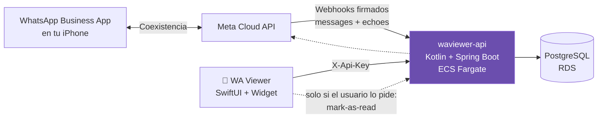

# 📬 WA Viewer — Visor de mensajes sin leer de WhatsApp Business

App de iPhone (publicable en App Store) + backend Kotlin/AWS para **ver los mensajes de WhatsApp Business sin marcarlos como leídos**: el remitente nunca ve las palomitas azules hasta que tú lo decidas.

## ¿Por qué así? (contexto técnico)

- iOS **no permite** que una app lea notificaciones o datos de otra app (sandbox de Apple). El enfoque Android tipo "Unseen" es imposible en iPhone y sería rechazado en el App Store.
- La solución oficial: **WhatsApp Coexistence** (Meta, 2025). Tu número Business funciona **a la vez** en la app WhatsApp Business del teléfono y en la **Cloud API**. Cada mensaje entrante llega también por webhook a este backend.
- Recibir mensajes por webhook **no envía confirmaciones de lectura**. Las palomitas azules solo se disparan si abres el chat en WhatsApp o si el backend llama explícitamente al endpoint `mark-as-read` de Meta (botón opcional en la app).

**Limitaciones heredadas de Meta:** solo chats 1:1 (los grupos no se sincronizan), solo números WhatsApp **Business** (no WhatsApp personal), historial inicial de hasta 6 meses, throughput fijo de 5 msg/s en coexistencia.

## Arquitectura



- `backend/` — Kotlin + Spring Boot 3 (mismo stack que xsbec/arenita): webhook de Meta con verificación de firma HMAC-SHA256, ingesta idempotente, API REST para la app.
- `ios/` — App SwiftUI (iOS 17+) con lista de no leídos, detalle de conversación y **widget de pantalla de inicio** (WidgetKit) con el contador. Proyecto generado con XcodeGen.
- `.github/workflows/deploy.yml` — build Docker → ECR → deploy ECS (activar cuando este directorio sea su propio repositorio).

## Endpoints del backend

| Method | Path | Auth | Description |
|--------|------|------|-------------|
| GET | `/api/v1/webhook` | verify token | Verificación del webhook (panel de Meta) |
| POST | `/api/v1/webhook` | firma HMAC | Recepción de eventos de la Cloud API |
| GET | `/api/v1/conversations?onlyUnread=` | X-Api-Key | Conversaciones (con contador de no leídos) |
| GET | `/api/v1/conversations/{id}/messages` | X-Api-Key | Mensajes del hilo |
| POST | `/api/v1/conversations/{id}/read-local` | X-Api-Key | Visto en el visor (NO toca WhatsApp) |
| POST | `/api/v1/conversations/{id}/read-upstream` | X-Api-Key | Envía palomitas azules (explícito) |
| GET | `/api/v1/summary` | X-Api-Key | Resumen para el widget |

## Puesta en marcha

### 1. Backend local

```bash
cd backend
./gradlew bootRun --args='--spring.profiles.active=dev'
# Swagger: http://localhost:8084/swagger-ui/index.html
```

### 2. Configurar Meta (una sola vez)

1. Crea una app en [Meta for Developers](https://developers.facebook.com) de tipo *Business* y añade el producto **WhatsApp**.
2. En **WhatsApp → Configuration** registra el webhook: URL pública `https://<tu-dominio>/api/v1/webhook`, verify token = `META_VERIFY_TOKEN`. Suscríbete a los campos `messages`, `smb_message_echoes` y `smb_app_state_sync`.
3. **Coexistencia**: desde el Embedded Signup (o un BSP), vincula tu número de la app WhatsApp Business escaneando el QR. Requisitos: app Business activa ≥ 7 días y versión reciente. La app del teléfono sigue funcionando normal; sincroniza hasta 6 meses de historial.
4. Genera un token de sistema con permiso `whatsapp_business_messaging` y copia el **Phone Number ID**.

### 3. Variables de entorno (ECS task / docker-compose)

| Variable | Descripción |
|----------|-------------|
| `META_VERIFY_TOKEN` | Token arbitrario, igual al configurado en el panel de Meta |
| `META_APP_SECRET` | App Secret (firma de webhooks) |
| `META_ACCESS_TOKEN` | Token de sistema (solo se usa para mark-as-read) |
| `META_PHONE_NUMBER_ID` | Phone Number ID del número Business |
| `VIEWER_API_KEY` | API key que usará la app iOS |
| `SPRING_DATASOURCE_URL/USERNAME/PASSWORD` | PostgreSQL (perfil `prod`) |

### 4. App iOS

```bash
cd ios
brew install xcodegen
xcodegen generate
open WaViewer.xcodeproj
```

Ajusta `DEVELOPMENT_TEAM` y los bundle ids en `project.yml` a tu cuenta de Apple Developer. En el primer arranque la app pide URL del backend + API key (se comparten con el widget vía App Group `group.com.waviewer.shared` — créalo en tu cuenta).

## Notas para App Store

- La app **no usa APIs privadas** ni accede a WhatsApp: solo habla con tu backend. Es publicable.
- En App Review describe el producto como cliente del **WhatsApp Business Platform (Cloud API)** de Meta — integración oficial. Prepara una cuenta demo (App Review exige credenciales de prueba).
- Privacidad: los mensajes viven en tu RDS. Declara en App Privacy: "Messages" vinculados a identidad, sin tracking. Añade política de privacidad pública.
- Si el producto se ofrecerá a terceros (multiusuario), cada cliente debe vincular su propio número vía Embedded Signup; para MVP monousuario basta con tu número.

## Roadmap sugerido

- [ ] Push notifications propias (APNs vía SNS) cuando llegue mensaje nuevo, con preview — así ni siquiera abres el visor.
- [ ] Descarga de media (imágenes/audio) vía Media API de Meta con URLs firmadas.
- [ ] Multi-cuenta / multi-tenant con Embedded Signup para venderlo como SaaS.
- [ ] Live Activity / Dynamic Island con el contador.
